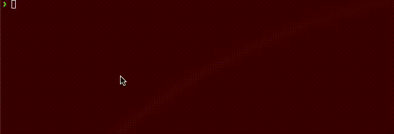

# Blueprint DSL: Scaffolding to create Structurizr Workspaces

[Structurizr Workspaces](https://docs.structurizr.com/workspaces) are a great way to document and share architecture diagrams in the [C4 model](https://c4model.com/). However, the diagram creation is freeform and there are no guidelines to break code into files, leaving architects and developers with a frustrating feeling of not knowing where to start.

This is an opinionated scaffolding tool written in Node.js that attempts to create the building blocks of a solid system architecture documentation, that accounts for newcomers as well as architects experienced in Structurizr, to allow them to follow a convention while setting them up for success.



## Usage

To use it globally, run:

```bash
npx arch-formula/blueprint-dsl --dest {docs_folder}
```

where `{docs_folder}` is a folder where dsl files will be generated. The tool creates an `architecture/` folder and starts scaffolding from there.

Full documentation [here](docs/architecture/docs/01-usage.md).
